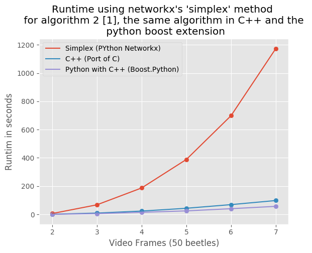

## Summary 

This is a modification to the C++ implementation of CS2 min-cost-flow
scaling algorithm see CREDITS for full details.

The main additions are reading a certain file structure into the algorithm and outputing the
cost and flow to a file, this is all wrapped into an MCMFProblem object which includes 
code to compile a Boost.Python module.

Currently the python module can perform [networkx.network_simplex](https://networkx.github.io/documentation/networkx-1.10/reference/generated/networkx.algorithms.flow.network_simplex.html) with a
very significant speed up.

## More details on what this achieves

The main goal is to implement algorithm 2 (post graph construction part) of [1] this is contained in the mcmf_ext.MCMFProblem.PythonTrajectories() method of the pytohn module. Look at the benchmarks
to see why it is useful to create a Boost.Python module for this instead of using raw python.

## Benchmark 

**Note** the C++ code was improved between the *C++* and *Python with C++ (Boost.Python)* benchmarks 
so the increase in speed in the python module is likely caused by an increase in the
new C++ code.

## TODO

Re-organise the C++ code so the Boost.Python is optional

Finish the python module functionality
- Offer just the min cost algorithm
- Complete mirror of networkx.network_simplex input/output
- Create distributeable?
- Offer interface with Keras for learning costs? [2]

### References 

[[1] Global data association for multi-object tracking using network flows, Li Zhang et al, 2008](https://ieeexplore.ieee.org/document/4587584/)

[[2] Deep Network Flow for Multi-Object Tracking, Samuel Schulter et al, 2017](https://arxiv.org/abs/1706.08482)

Harvey Devereux
July 2018
h.devereux@warwick.ac.uk

 ################################################
## Original README.txt below (Cristinel Ababei) ##
 ################################################

Cristinel Ababei
January 2009, Fargo ND
cristinel.ababei@ndsu.edu

SUMMARY
=======

This is a C++ implementation of CS2 min-cost-max-flow scaling algorithm.

This is intended to be one of the cleanest and simplest to use minimum-cost
max-flow (MCMF) implementation using C++.  If you have a C++ application in
which you need to use a MCMF algo, then this may be your most elegant bet.
See main() function for an example of how to use it.

I compiled it on Linux Fedora, using g++.  If you have any  question please
contact Cristinel.

CREDITS
=======

This is an adapted (i.e., ported to C++) version of the faimous CS2 algo;
CS2 is the second version of scaling algorithm for minimum-cost max-flow
problems.  For a detailed description of this famous algo, see:
A.V. Goldberg, "An Efficient Implementation of a Scaling Minimum-Cost
Flow Algorithm", Journal of Algorithms, vol. 22, pp. 1-29, 1997.

CS2 was developed by Andrew Goldberg (goldberg@intertrust.com) and
Boris Cherkassky (cher@cher.msk.su).

The original C version is located in cs2-4.3/

COPYRIGHT
=========

The program is available on "as is" basis.  It is not guaranteed to
be free of bugs, and the author assumes no responsibility for any
potential problems.
The original copyright notice of the C version applies to this C++
version as well.

ACADEMIA
========

If you use this C++ version in any research project and want to
include references to it, then please use:

[1] Cristinel Ababei, C++ Implementation of Goldberg's CS2 Scaling
    Minimum-Cost Flow Algorithm, 2009, [Online], Available:
    http://www.ece.ndsu.nodak.edu/~cris/software.html

[2] A.V. Goldberg, An Efficient Implementation of a Scaling
    Minimum-Cost Flow Algorithm, Journal of Algorithms, Vol. 22,
    pp. 1-29, 1997.

FINAL NOTE
==========

If you'll ever hit it big (to be read: make a lot of money :-) ),
and this code helped you in any way, then please consider
donating some to support my research (I need it :-) ).
